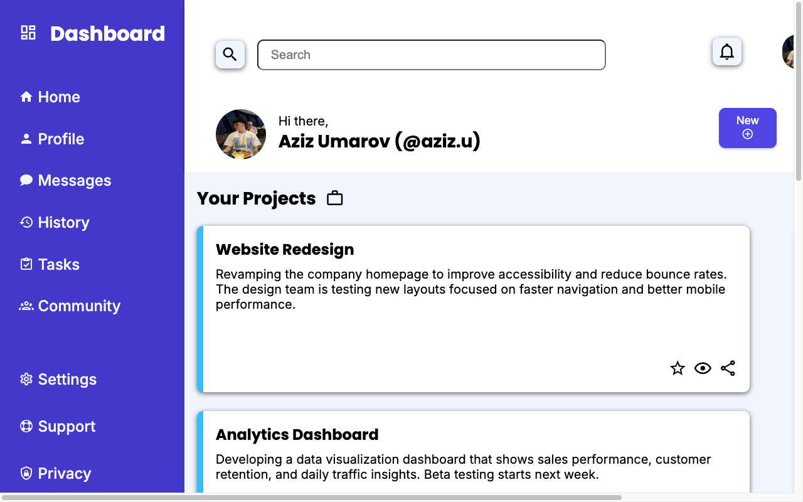

# Admin Dashboard

A static admin-dashboard layout built to reinforce **CSS Grid** — a persistent sidebar,
header controls, a project-card grid, and announcements/trending panels.

🔗 **Live demo:** [admin-dash-xi.vercel.app](https://admin-dash-xi.vercel.app/)



## Features

- CSS Grid layout for sidebar, header, main project area, and secondary panels.
- Sidebar navigation with dashboard-style icon/text hierarchy.
- Project-card area for scanning multiple work items.
- Announcements and trending sections for dense dashboard composition.

## Tech stack

HTML · CSS (CSS Grid; no build step)

## Getting started

Open `index.html` directly, or serve the folder:

```bash
npx serve .
```

## What I practiced

Composing a real product layout with **CSS Grid** — named areas, aligned columns, and a
clear administrative scanning hierarchy.

## License

Odin Project coursework — original implementation by Aziz Umarov.
